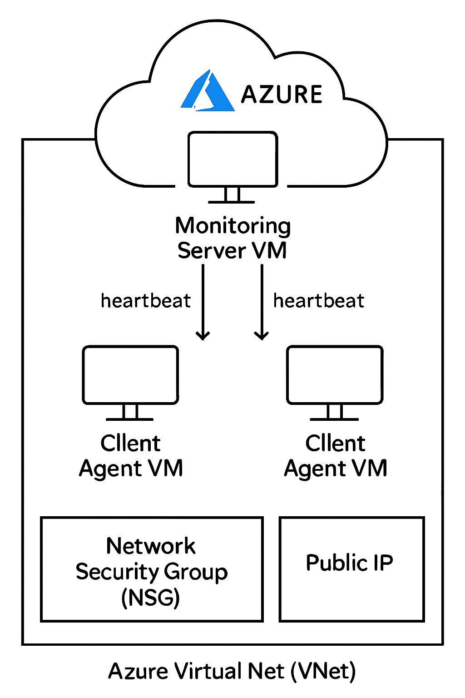
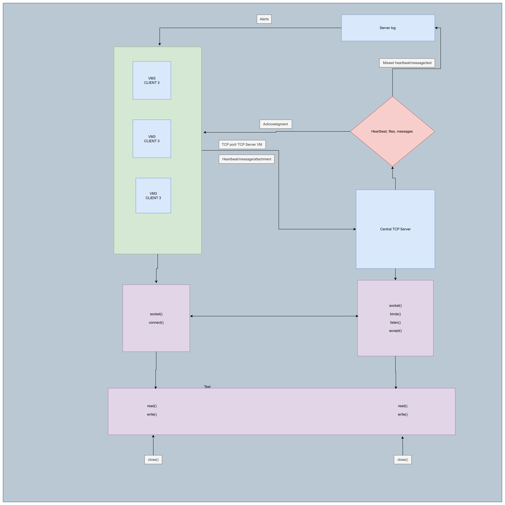

# System Design 
## Block diagram 

```
Local Setup
────────────
┌──────────────┐            ┌────────────────────────────┐
│  Client PC   │            │     Local Server PC        │
│  - client.py │ ── TCP ──▶ |    -server.py              |
│  - Sends     │            │    - Listens on port       │
│    HEARTBEAT |            |    - Monitore Heartbeat    |
|  - Messages  |            |    - Receive and send      |
|  - Attachment|            |       messages             |
|              |            |    - Receieve Attachment   |
└──────────────┘            └────────────────────────────┘


Cloud Setup (Azure)
───────────────────
                ┌────────────────────────────┐
                │      Azure Cloud Platform  │
                └────────────┬───────────────┘
                             │
      ┌──────────────────────┴──────────────────────┐
      │                                             │
 ┌──────────────┐                             ┌──────────────┐
 │  Client VM 1 │                             │  Client VM 2 │
 │  - client.py │                             │  - client.py │
 │  - Sends     │                             │  - Sends     │
 │    HEARTBEAT │                             │    HEARTBEAT │
 └──────┬──────-┘                             └──────┬────── ┘
        │                                            │
        └───────────── TCP PORT 5001 —───────────────┘
                           (HEARTBEAT / MESSAGE / FILE)
                                    ↓
                    ┌────────────────────────────┐
                    │      Server VM (server.py)  │
                    │    - Accepts connections    │
                    │    - Logs heartbeats        │
                    │    - Alerts on heartbeat timeout │
                    └────────────────────────────┘
```
## Sequence Diagram 
```
Client Agent                      Monitoring Server
     |                                    |
     | --- Connect to Server (TCP) ----> |
     |                                    |
     | <------- Connection ACK --------- |
     |                                    |

--- Heartbeat Loop (every 20 seconds) ----
     | --- Send HEARTBEAT message ------> |
     |                                    |
     | <----- Optional server response --- |
     |                                    |
     | ------ Wait 20 seconds ------------ |
     |                                    |
     | --- Send HEARTBEAT message ------> |
     |                                    |
     |               ... repeated ...     |
-------------------------------------------

--- Interactive Messaging -----------------
     | --- Send chat/message ------------> |
     |                                    |
     | <----- Server reply/message -------|
     |                                    |
     | --- Send next message or 'bye' --> |
     |                                    |
     |         Repeat until 'bye'         |
-------------------------------------------

--- File Transfer -------------------------
     | --- Send file info:                |
     |     "filename|filesize" ---------> |
     |                                    |
     | <---- Server replies:               |
     |      "READY|filename" or           |
     |      "REJECT|filename" ----------- |
     |                                    |
     | --- If READY, send file bytes ---->|
     |                                    |
     |               ... file bytes ...   |
     |                                    |
     | --- Repeat for next files or send  |
     |     "END" when done -------------->|
     |                                    |
-------------------------------------------

     | ---- Close connection (optional) ---> |
     |                                    |
```
## Flow Diagram 
   